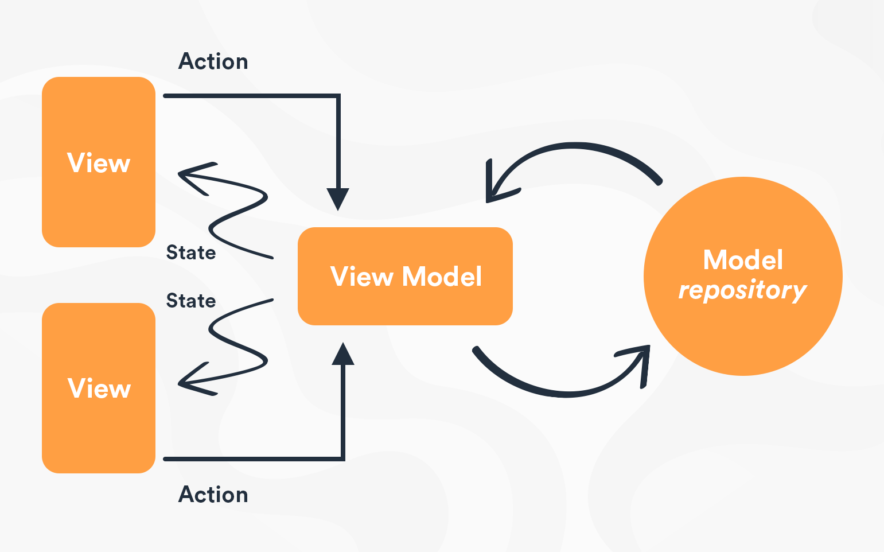

# MVVM
Model-View-ViewModel (MVVM)

The well-ordered and perhaps the most reusable way to organize your code is to use the 'MVVM' pattern. The Model, View, ViewModel (MVVM pattern) is all about guiding you in how to organize and structure your code to write maintainable, testable and extensible applications.

Model − It simply holds the data and has nothing to do with any of the business logic.

ViewModel − It acts as the link/connection between the Model and View and makes stuff look pretty.

View − It simply holds the formatted data and essentially delegates everything to the Model.

To avoid the problems caused by putting application logic in code-behind or XAML, it's best to use a technique known as separated presentation. We're trying to avoid this, where we will have XAML and code-behind with the minimum required for working with user interface objects directly. User interface classes also contain code for complex interaction behaviors, application logic, and everything else as shown in the following figure on the left side.

Model–view–viewmodel is a software architectural pattern that facilitates the separation of the development of the graphical user interface – be it via a markup language or GUI code – from the development of the business logic or back-end logic so that the view is not dependent on any specific model platform.

Every good developer wants and tries to create the most sophisticated applications to delight their users. Most of the times, developers achieve this on the first release of the application. However, with new feature addition, fixing the bug without putting a lot of consideration into the structure of the application code becomes difficult due to code complexity. For this, there is a need for good clean structure of code.

This is structure of MVVM contains classes of model and view model using this we can easily manage API calling structure and manage code properly. Use this pattern when you need to transform models into another representation for a view. This pattern compliments MVC especially well. Without view models, you’d likely put model-to-view transformation code in your view controller. How can you avoid overstuffing your view controllers? It’s easy – use other patterns besides MVC! MVVM is a great way to slim down massive view controllers that require several model-to-view transformations.

